# Claude AI 마스터 개발 가이드
*Claude Code 작업을 위한 종합 가이드라인 및 자동화 규칙*

---

## 📌 핵심 작업 원칙

### 🎯 1. 필수 작업 절차 (Critical Workflow)
**모든 코드 수정 시 반드시 따라야 할 5단계 프로세스:**

```mermaid
graph LR
    A[코드 수정] --> B[로컬 테스트]
    B --> C[버전 업데이트]
    C --> D[Git 커밋/푸시]
    D --> E[GitHub 확인]
    E --> F[캐시 갱신 안내]
```



1. **로컬 테스트 실행**
   - 수정사항 정상 작동 확인
   - 단위 테스트 실행: `python test_*.py` 또는 `npm test`
   - 통합 테스트 확인

2. **버전 번호 업데이트**
   - 프로젝트별 버전 파일 위치 확인
   - Semantic Versioning 준수 (Major.Minor.Patch)
   - README.md 변경사항 기록

3. **Git 작업 자동화**
   ```bash
   git add -A
   git commit -m "type: 간결한 설명 (v버전)"
   git push origin main
   ```

4. **GitHub 변경사항 검증**
   ```javascript
   // WebFetch로 실제 배포 확인
   WebFetch("https://raw.githubusercontent.com/[repo]/main/[file]")
   // 확인사항: 버전, 수정 함수, 변경 로직
   ```

5. **브라우저 캐시 처리**
   - 사용자에게 Ctrl+Shift+R (강제 새로고침) 안내
   - 또는 버전 쿼리 파라미터 추가: `?v=1.2.3`

### 🤖 2. Subagents & MCP 활용 전략

#### 작업별 최적 Agent 매핑
| 작업 유형 | 추천 Subagent | 대체 옵션 |
|---------|--------------|----------|
| API 설계 | `backend-architect` | `system-designer` |
| Python 개발 | `python-pro` | `backend-developer` |
| React/Next.js | `frontend-developer` | `typescript-expert` |
| 테스트 작성 | `test-automator` | `qa-engineer` |
| 보안 검토 | `security-auditor` | `penetration-tester` |
| 성능 최적화 | `performance-engineer` | `database-optimizer` |
| 배포/CI/CD | `deployment-engineer` | `devops-expert` |

#### MCP 도구 우선순위
```python
# 우선 사용 MCP
PRIMARY_MCPS = [
    "mcp__ide__",        # IDE 통합 기능
    "mcp__supabase__",   # DB 작업
    "mcp__github__",     # 저장소 관리
    "mcp__context7__",   # 문서 검색
]

# 보조 MCP
SECONDARY_MCPS = [
    "mcp__exa__",        # 웹 검색
    "mcp__slack__",      # 알림
    "mcp__stripe__",     # 결제
]
```

### 🌍 3. 언어 및 문서화 규칙

- **한글 우선 정책**
  - 모든 응답과 주석은 한글로 작성
  - 기술 용어: `한글명(English)` 형식
  - 예: "비동기 처리(Async)", "의존성 주입(Dependency Injection)"

- **문서 구조 표준**
  ```markdown
  # 프로젝트명
  ## 개요
  ## 설치 방법
  ## 사용법
  ## API 문서
  ## 변경 이력
  ## 라이선스
  ```

---

## 🚀 고급 자동화 스크립트

### Git 작업 자동화
```python
# auto_deploy.py
import subprocess
import json
from datetime import datetime

def auto_deploy(commit_type="feat", description="Update"):
    """완전 자동화된 배포 프로세스"""
    # 1. 버전 증가
    version = increment_version()

    # 2. README 업데이트
    update_readme(version, description)

    # 3. Git 작업
    commands = [
        "git add -A",
        f'git commit -m "{commit_type}: {description} (v{version})"',
        "git push origin main"
    ]

    for cmd in commands:
        subprocess.run(cmd, shell=True)

    # 4. GitHub 확인
    verify_deployment(version)

    print(f"✅ 배포 완료: v{version}")
```

### 프로젝트 초기화 템플릿
```bash
# 새 프로젝트 시작 시 자동 실행
create_project() {
    mkdir -p $1/{src,tests,docs,scripts}
    cd $1

    # 가상환경 설정
    python -m venv venv
    source venv/bin/activate  # Linux/Mac
    # venv\Scripts\activate  # Windows

    # 기본 파일 생성
    touch README.md requirements.txt .gitignore
    echo "# $1" > README.md

    # Git 초기화
    git init
    git add .
    git commit -m "feat: Initialize project $1"
}
```

---

## 📊 버전 관리 시스템

### Semantic Versioning 2.0.0
```
MAJOR.MINOR.PATCH

- MAJOR: 하위 호환성을 깨뜨리는 변경
- MINOR: 하위 호환성 유지하며 기능 추가
- PATCH: 하위 호환성 유지하며 버그 수정
```

### 커밋 메시지 컨벤션
```
type(scope): subject

[body]

[footer]
```

**Type 목록:**
- `feat`: 새로운 기능 추가
- `fix`: 버그 수정
- `docs`: 문서 수정
- `style`: 코드 포맷팅, 세미콜론 누락 등
- `refactor`: 코드 리팩토링
- `perf`: 성능 개선
- `test`: 테스트 추가/수정
- `chore`: 빌드, 패키지 매니저 설정 등
- `revert`: 이전 커밋 되돌리기

---

## 🛠️ 도구별 빠른 참조

### Python 프로젝트
```bash
# 환경 설정
python -m venv venv
venv\Scripts\activate  # Windows
source venv/bin/activate  # Linux/Mac

# 의존성 관리
pip install -r requirements.txt
pip freeze > requirements.txt

# 테스트 실행
pytest tests/ -v --cov=src
python -m unittest discover
```

### Node.js/React 프로젝트
```bash
# 프로젝트 초기화
npx create-react-app my-app --template typescript
npm install

# 개발 서버
npm run dev
npm run build
npm run test

# 의존성 업데이트
npm outdated
npm update
```

### Docker 운영
```bash
# 컨테이너 관리
docker-compose up -d
docker-compose down
docker-compose logs -f [service]

# 이미지 정리
docker system prune -a
docker volume prune
```

---

## 🔍 문제 해결 체크리스트

### 디버깅 순서
1. ⬜ 에러 메시지 정확히 읽기
2. ⬜ 관련 로그 파일 확인
3. ⬜ 최근 변경사항 검토
4. ⬜ 의존성 버전 충돌 확인
5. ⬜ 환경 변수 설정 확인
6. ⬜ 네트워크/권한 문제 확인
7. ⬜ 캐시 삭제 후 재시도

### 성능 최적화 체크포인트
- ⬜ 데이터베이스 쿼리 최적화 (N+1 문제)
- ⬜ 캐싱 전략 구현 (Redis/Memcached)
- ⬜ 이미지/정적 파일 CDN 활용
- ⬜ 코드 번들 사이즈 최소화
- ⬜ 비동기 처리 및 지연 로딩
- ⬜ 메모리 누수 점검

---

## 📋 프로젝트별 설정 관리

### 프로젝트 구조 템플릿
```
project-root/
├── .github/            # GitHub Actions, 이슈 템플릿
├── docs/              # 프로젝트 문서
├── scripts/           # 유틸리티 스크립트
├── src/              # 소스 코드
│   ├── components/   # UI 컴포넌트
│   ├── services/     # 비즈니스 로직
│   ├── utils/        # 유틸리티 함수
│   └── tests/        # 테스트 파일
├── .env.example      # 환경변수 예시
├── .gitignore        # Git 제외 파일
├── CLAUDE.md         # Claude AI 전용 가이드
├── README.md         # 프로젝트 문서
└── package.json      # 의존성 관리
```

### 환경별 설정
```python
# config.py
import os
from enum import Enum

class Environment(Enum):
    DEVELOPMENT = "development"
    STAGING = "staging"
    PRODUCTION = "production"

ENV = os.getenv("ENVIRONMENT", Environment.DEVELOPMENT.value)

CONFIGS = {
    Environment.DEVELOPMENT: {
        "debug": True,
        "database": "sqlite:///dev.db",
        "api_url": "http://localhost:8000"
    },
    Environment.PRODUCTION: {
        "debug": False,
        "database": os.getenv("DATABASE_URL"),
        "api_url": "https://api.production.com"
    }
}

config = CONFIGS.get(Environment(ENV))
```

---

## 🔐 보안 모범 사례

### 필수 보안 체크리스트
- ⬜ 환경변수로 민감정보 관리 (.env 파일)
- ⬜ SQL Injection 방지 (Prepared Statements)
- ⬜ XSS 방지 (입력값 검증 및 이스케이프)
- ⬜ CSRF 토큰 구현
- ⬜ Rate Limiting 적용
- ⬜ HTTPS 강제 적용
- ⬜ 보안 헤더 설정 (CSP, HSTS 등)
- ⬜ 정기적인 의존성 취약점 스캔

### 비밀 정보 관리
```bash
# .gitignore에 추가
.env
.env.*
*.key
*.pem
secrets/
```

---

## 📈 모니터링 및 로깅

### 로깅 레벨 가이드
```python
import logging

# 로깅 설정
logging.basicConfig(
    level=logging.INFO,
    format='%(asctime)s - %(name)s - %(levelname)s - %(message)s'
)

logger = logging.getLogger(__name__)

# 사용 예시
logger.debug("상세 디버그 정보")      # 개발 환경
logger.info("일반 정보성 메시지")      # 운영 환경
logger.warning("경고 메시지")          # 주의 필요
logger.error("에러 발생", exc_info=True) # 에러 추적
logger.critical("심각한 오류")         # 즉시 대응 필요
```

### 성능 모니터링 메트릭
- 응답 시간 (Response Time)
- 처리량 (Throughput)
- 에러율 (Error Rate)
- CPU/메모리 사용률
- 데이터베이스 쿼리 시간

---

## 🚦 작업 흐름 최적화

### 병렬 처리 전략
```python
# 여러 도구 동시 호출 예시
async def parallel_tasks():
    tasks = [
        read_file("config.json"),
        fetch_api_data(),
        check_database_status()
    ]
    results = await asyncio.gather(*tasks)
    return results
```

### 토큰 최적화 기법
1. **청크 단위 파일 읽기**
   ```python
   # 큰 파일은 부분적으로 읽기
   Read(file_path="large_file.txt", offset=0, limit=1000)
   ```

2. **필요한 정보만 추출**
   ```python
   # Grep으로 관련 부분만 찾기
   Grep(pattern="function_name", glob="*.js")
   ```

3. **캐싱 활용**
   - WebFetch 15분 자동 캐싱
   - 결과 재사용으로 API 호출 감소

---

## 📚 빠른 참조 링크

### 공식 문서
- [Claude Code 문서](https://docs.anthropic.com/en/docs/claude-code)
- [GitHub 피드백](https://github.com/anthropics/claude-code/issues)

### 주요 MCP 문서
- [Supabase MCP](https://github.com/supabase/mcp)
- [Context7 MCP](https://github.com/context7/mcp)
- [GitHub MCP](https://github.com/github/mcp)

### 개발 도구
- [Python 공식 문서](https://docs.python.org)
- [MDN Web Docs](https://developer.mozilla.org)
- [Docker 문서](https://docs.docker.com)

---

## 🔄 정기 유지보수 스케줄

### 일일 체크
- [ ] 테스트 스위트 실행 상태
- [ ] API 할당량 및 사용량
- [ ] 에러 로그 모니터링

### 주간 작업
- [ ] 의존성 업데이트 확인 (`npm outdated`, `pip list --outdated`)
- [ ] 보안 취약점 스캔 (`npm audit`, `safety check`)
- [ ] 백업 무결성 검증

### 월간 검토
- [ ] 성능 메트릭 분석 및 최적화
- [ ] 문서 최신화 상태 점검
- [ ] 비용 분석 및 리소스 최적화
- [ ] 사용하지 않는 코드/의존성 정리

---

## 💡 프로 팁

### 효율성 극대화
1. **병렬 도구 호출**: 독립적인 작업은 동시 실행
2. **스마트 캐싱**: 반복 작업 결과 재활용
3. **조기 실패**: 빠른 검증으로 시간 절약
4. **자동화 우선**: 반복 작업은 스크립트로

### 품질 보증
1. **TDD 접근**: 테스트 먼저, 구현은 나중에
2. **코드 리뷰**: Subagent 활용한 자동 검토
3. **점진적 개선**: 작은 단위로 자주 배포
4. **문서화**: 코드와 함께 문서도 업데이트

---

**최종 업데이트**: 2025-09-17
**버전**: 2.0.0
**작성자**: Claude AI Assistant

*이 문서는 Claude Code 작업의 표준 가이드라인입니다.*
*모든 프로젝트에서 이 규칙을 준수하여 일관성 있는 개발을 진행하세요.*