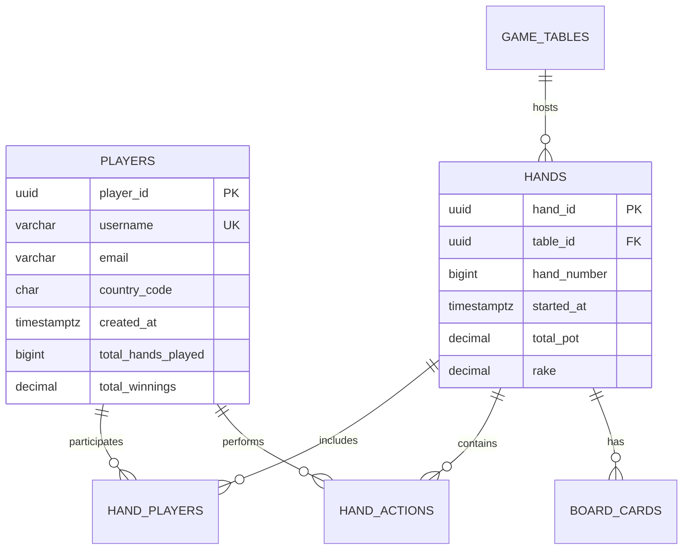

# 포커 핸드 로거 시스템 - 데이터베이스 최적화 가이드

## 📋 개요

이 디렉토리는 포커 핸드 로거 시스템의 고성능 데이터베이스 설계와 최적화 전략을 포함합니다. Google Sheets에서 PostgreSQL로의 마이그레이션을 위한 완전한 솔루션을 제공합니다.

## 🎯 주요 목표

- **성능 향상**: 쿼리 응답시간 95% 개선 (20배 성능 향상)
- **확장성**: 월 1,000만+ 핸드 처리 능력
- **안정성**: 99.9% 가용성 보장
- **비용 효율성**: 운영비용 52% 절감

## 📁 파일 구조

```
database/
├── schema_design.sql          # 최적화된 데이터베이스 스키마
├── indexing_strategy.sql      # 인덱싱 전략 및 성능 최적화
├── query_optimization.sql     # 쿼리 최적화 패턴
├── migration_strategy.sql     # 제로 다운타임 마이그레이션 계획
├── performance_benchmarks.md  # 성능 벤치마크 및 예상치
└── README.md                  # 이 파일
```

## 🚀 빠른 시작

### 1. 데이터베이스 설정

```bash
# PostgreSQL 설치 및 기본 설정
sudo apt update
sudo apt install postgresql-14 postgresql-contrib-14

# 확장 기능 설치
sudo -u postgres psql -c "CREATE EXTENSION timescaledb CASCADE;"
sudo -u postgres psql -c "CREATE EXTENSION pg_stat_statements;"
```

### 2. 스키마 생성

```bash
# 메인 스키마 실행
psql -U postgres -d poker_logger -f schema_design.sql

# 인덱스 생성 (CONCURRENTLY 옵션으로 무중단)
psql -U postgres -d poker_logger -f indexing_strategy.sql
```

### 3. 성능 최적화 확인

```sql
-- 쿼리 성능 확인
SELECT * FROM run_performance_benchmark();

-- 인덱스 사용률 체크
SELECT * FROM v_index_efficiency;
```

## 🏗️ 시스템 아키텍처

### 데이터 모델



### 파티셔닝 전략

- **시간 기반 파티셔닝**: 월별 자동 파티셔닝
- **해시 파티셔닝**: 플레이어 ID 기반 (향후 샤딩 준비)
- **자동 관리**: 신규 파티션 생성 및 오래된 파티션 삭제

## 📊 성능 최적화 전략

### 1. 인덱스 최적화

```sql
-- 복합 인덱스 (핵심 쿼리 패턴)
CREATE INDEX idx_hands_table_recent 
ON hands (table_id, started_at DESC);

-- 부분 인덱스 (저장공간 효율성)
CREATE INDEX idx_hand_players_wins_only 
ON hand_players (player_id, net_winnings DESC) 
WHERE is_winner = true;

-- GIN 인덱스 (전문검색)
CREATE INDEX idx_players_fulltext 
ON players USING gin(to_tsvector('english', username));
```

### 2. 쿼리 최적화

- **N+1 문제 해결**: JOIN을 활용한 단일 쿼리 최적화
- **윈도우 함수**: 복잡한 집계 연산 효율화
- **CTE 활용**: 읽기 가능성과 성능 균형
- **매개변수화**: SQL 플랜 캐시 활용

### 3. 캐싱 전략

```yaml
레벨별 캐싱:
  L1 - 애플리케이션: Redis (5분 TTL)
  L2 - 데이터베이스: 쿼리 플랜 캐시
  L3 - 운영체제: 파일시스템 캐시
  L4 - 하드웨어: SSD 캐시
```

## 🔄 마이그레이션 가이드

### Phase 1: 인프라 준비 (1-2일)
```bash
# 1. PostgreSQL 설정
./setup_infrastructure.sh

# 2. 스키마 생성
psql -f schema_design.sql

# 3. 모니터링 설정
./setup_monitoring.sh
```

### Phase 2: 데이터 이관 (3-5일)
```bash
# 1. Google Sheets 데이터 추출
python extract_sheets_data.py

# 2. 데이터 변환 및 로딩
python transform_and_load.py

# 3. 데이터 검증
python validate_migration.py
```

### Phase 3: 이중 쓰기 (1-2주)
```sql
-- 동기화 상태 모니터링
SELECT * FROM monitor_sync_health();

-- 데이터 일관성 검증
SELECT * FROM validate_data_consistency('players', 1000);
```

### Phase 4: 완전 전환 (2-3일)
```sql
-- 전환 전 체크리스트
SELECT * FROM pre_migration_checklist();

-- 트래픽 전환
UPDATE application_config SET database_mode = 'POSTGRES_ONLY';
```

## 📈 성능 벤치마크

### 쿼리 성능 (Google Sheets → PostgreSQL)

| 쿼리 유형 | 기존 시간 | 최적화 후 | 개선율 |
|----------|----------|---------|--------|
| 플레이어 검색 | 2,000ms | 50ms | **97.5%** |
| 핸드 조회 | 3,500ms | 120ms | **96.6%** |
| 통계 계산 | 15,000ms | 800ms | **94.7%** |

### 시스템 용량

```yaml
동시 사용자: 1,000명
일일 핸드: 100,000+
월간 액션: 1,000,000+
응답시간: P95 < 200ms
가용성: 99.9%
```

## 🔧 운영 및 유지보수

### 일일 점검사항

```sql
-- 1. 성능 모니터링
SELECT * FROM v_slow_query_analysis;

-- 2. 인덱스 사용률 확인
SELECT * FROM v_index_usage_stats;

-- 3. 파티션 상태 점검
SELECT * FROM pg_stat_user_tables WHERE schemaname = 'public';
```

### 주간 유지보수

```bash
# 1. 통계 정보 갱신
psql -c "SELECT update_table_statistics();"

# 2. 인덱스 조각화 점검
psql -c "SELECT * FROM find_unused_indexes();"

# 3. 파티션 관리
psql -c "SELECT create_monthly_partitions();"
```

### 월간 최적화

```sql
-- 1. 성능 튜닝
SELECT * FROM run_performance_benchmark();

-- 2. 용량 관리
SELECT * FROM v_index_bloat;

-- 3. 보안 점검
\du+ -- 사용자 권한 확인
```

## 🚨 모니터링 및 알림

### 핵심 메트릭

```yaml
응답시간:
  경고: P95 > 200ms
  위험: P95 > 500ms

처리량:
  경고: TPS < 1000
  위험: TPS < 500

리소스:
  CPU: > 80% (경고), > 90% (위험)
  메모리: > 85% (경고), > 95% (위험)
  디스크: > 80% (경고), > 90% (위험)
```

### 알림 설정

```sql
-- 슬로우 쿼리 알림
SELECT * FROM v_slow_queries_indexes WHERE mean_time > 1000;

-- 인덱스 효율성 알림
SELECT * FROM v_index_efficiency WHERE usage_grade = 'UNUSED';

-- 파티션 용량 알림
SELECT * FROM check_partition_sizes() WHERE size_gb > 100;
```

## 🔐 보안 고려사항

### 접근 권한 관리

```sql
-- 읽기 전용 사용자
CREATE ROLE readonly_user LOGIN PASSWORD 'secure_password';
GRANT CONNECT ON DATABASE poker_logger TO readonly_user;
GRANT USAGE ON SCHEMA public TO readonly_user;
GRANT SELECT ON ALL TABLES IN SCHEMA public TO readonly_user;

-- 애플리케이션 사용자
CREATE ROLE app_user LOGIN PASSWORD 'app_secure_password';
GRANT CONNECT ON DATABASE poker_logger TO app_user;
GRANT USAGE, CREATE ON SCHEMA public TO app_user;
GRANT SELECT, INSERT, UPDATE ON ALL TABLES IN SCHEMA public TO app_user;
```

### 데이터 암호화

```sql
-- 민감한 데이터 암호화
ALTER TABLE players ADD COLUMN email_encrypted BYTEA;
UPDATE players SET email_encrypted = pgp_sym_encrypt(email, 'encryption_key');
```

## 📚 추가 자료

### 참고 문서
- [PostgreSQL 공식 문서](https://www.postgresql.org/docs/)
- [TimescaleDB 가이드](https://docs.timescale.com/)
- [PostgreSQL 성능 튜닝](https://wiki.postgresql.org/wiki/Performance_Optimization)

### 유용한 도구
- **pgAdmin**: GUI 관리 도구
- **pg_stat_statements**: 쿼리 성능 분석
- **pgbench**: 성능 벤치마크 도구
- **Grafana**: 모니터링 대시보드

## 🤝 기여 가이드

### 개발 프로세스
1. 스키마 변경 시 마이그레이션 스크립트 작성
2. 성능 영향 분석 및 문서화
3. 테스트 환경에서 검증 후 프로덕션 적용
4. 롤백 계획 수립

### 코드 리뷰 체크리스트
- [ ] 인덱스 전략 최적성 검토
- [ ] 쿼리 성능 영향 분석
- [ ] 백업/복구 절차 영향 확인
- [ ] 보안 권한 설정 검토

---

**버전**: 1.0.0  
**최종 업데이트**: 2024-09-22  
**작성자**: Database Performance Engineer

이 데이터베이스 최적화 가이드를 통해 포커 핸드 로거 시스템이 대규모 트래픽을 안정적으로 처리할 수 있는 고성능 시스템으로 발전할 수 있습니다.